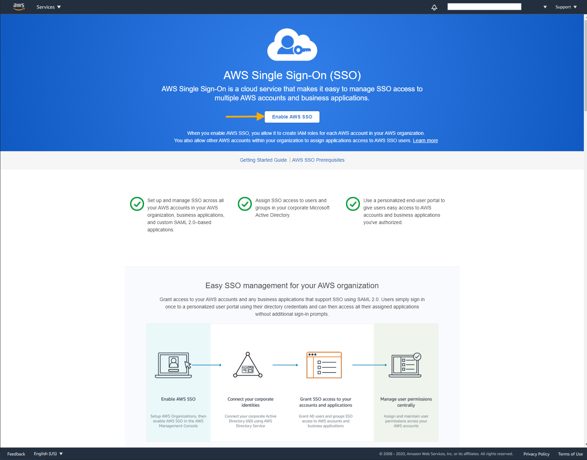
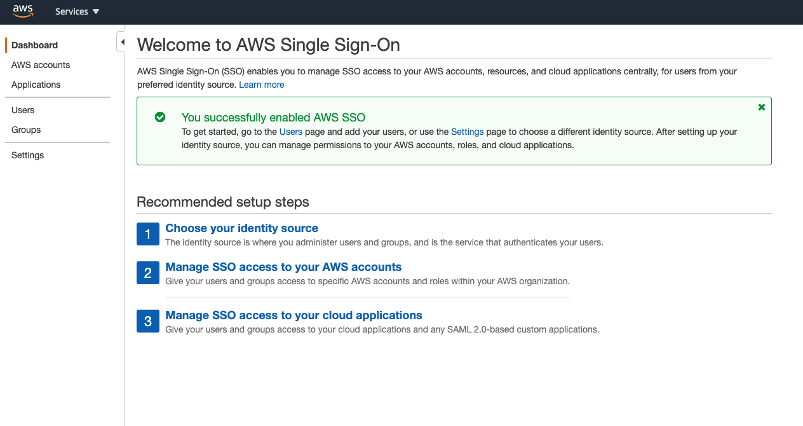
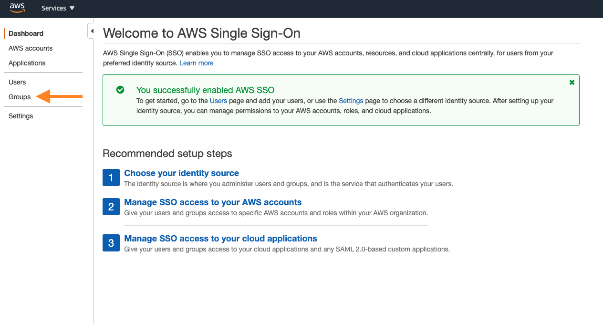
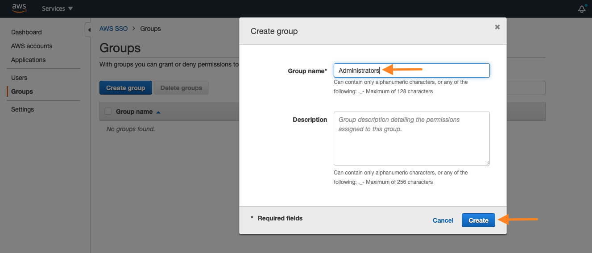
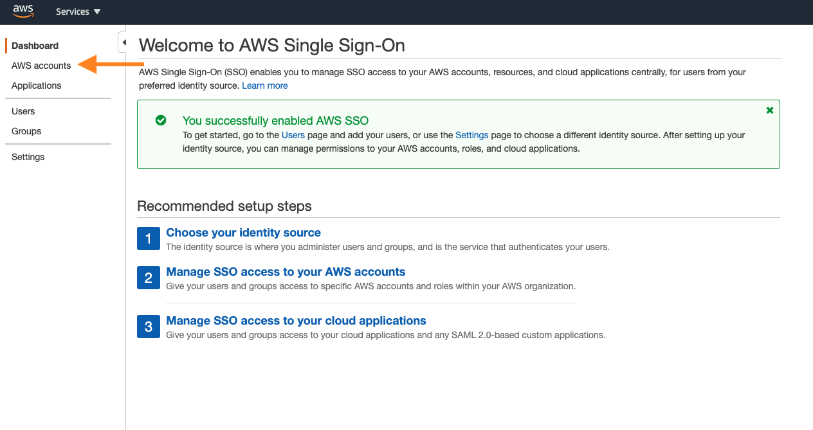
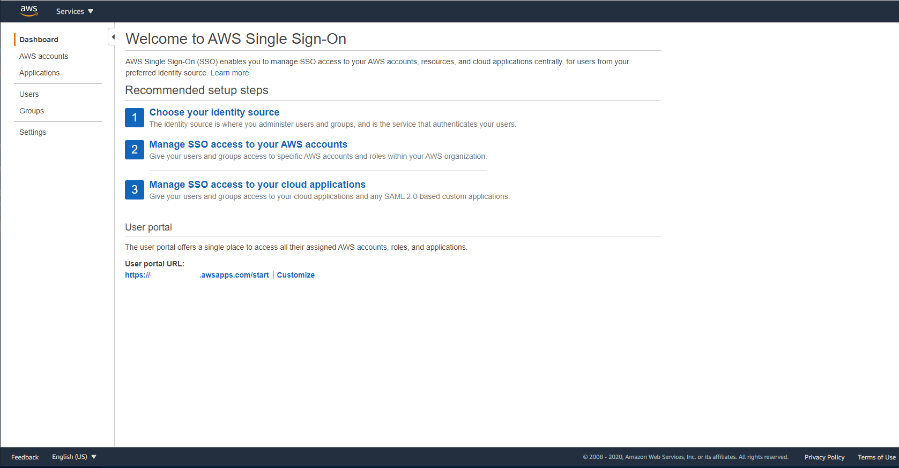
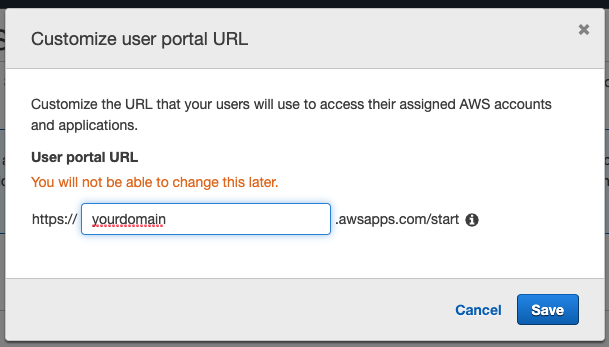
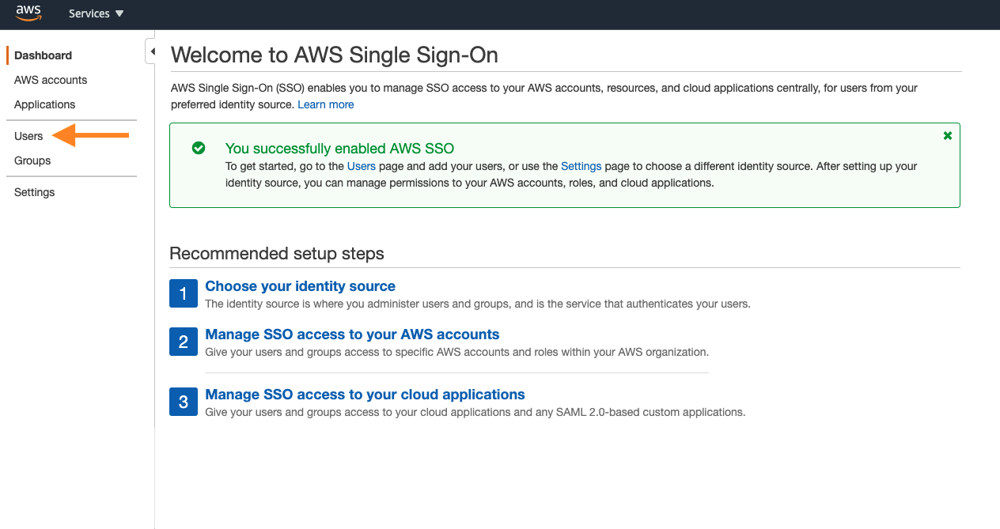

## Enable AWS SSO

**Introduction**

- Access management accross different AWS accounts is a complicated and painful tasks but now with AWS SSO it is much more easier and simple to handle such activities. In this tutorial we will focus around configuring AWS SSO to simplify user management across multiple accounts based on their roles.
- This tutorial is divided into below sections
    
    1. Switch AWS SSO for your organization
    2. Configure AWS SSO permission sets
    3. Configure AWS SSO groups
    4. Allocate groups to your accounts
    5. Customize your SSO endpoint
    6. Connect to the AWS Console using your SSO endpoint

**Tutorial**

- Step 1. Switch AWS SSO for your organization

    1. Go to the <a href="https://console.aws.amazon.com/singlesignon/home"> Inventory > AWS SSO home page </a>
       
       
    
    2. Select Enable AWS SSO
       
       
    
    3. Wait for AWS SSO to be enabled
       
       
    
    4. After SSO is switched, we will be navigated back to the SSO Dashboard and with a success message displayed.

       

- Step 2. Configure AWS SSO permission sets

    1. Select AWS accounts section
       
       
    
    2. Go to Permission sets tab and click Create permission set
       
       
    
    3. Choose Use an existing job function policy and click Next: Details 
       
       
    
    4. Select AdministratorAccess job function policy and click Next: Tags

       
       
    5. Select Next: Review :

       

    6. You can also modify the session duration and this will affect the amount of time a user can use the AWS Console or CLI before being automatically logged out. Otherwise, click Create to finalize the creation of the permissions set

       

    **Note:** You can repeat the above steps to define the other roles

- Step 3. Configure AWS SSO groups

    1. Select on the Groups Tab in the AWS SSO console
       
       
    
    2. Click Create group
       
       
    
    3. Type Administrators as the group name and click Create 
       
       

    **Note:** You can repeat the above steps to define the groups for other roles

- Step 4. Allocate groups to your accounts

    1. Select AWS Accounts section
       
       
    
    2. Check all your accounts and click Assign users
       
       
    
    3. Navigate to Groups tab, select Administrators group and click Next: Permissions set
       
       
    
    4. Mark AdministratorAccess permissions set and click Finish

    5. Wait until all selected accounts are being configured
    
    6. Once it is completed, select on Proceed to AWS accounts 

    **Note:** You can repeat the above steps for the other roles

- Step 5. Customize your SSO endpoint

    1. Navigate to the AWS SSO page and at the bottom of the page, select the Customize link
       
       
    
    2. Provide your domain name and click Save
       
       
    
    3. Now you can login to the AWS Console through your SSO portal using your customized URL

        

- Step 6. Connect to the AWS Console using your SSO endpoint
